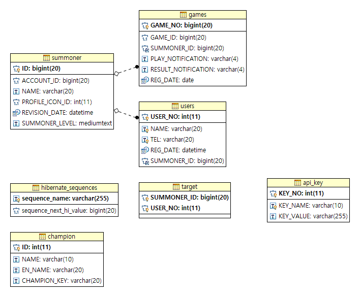

# lolhuni(유동후니 롤 추적기)

## Requirements

- JDK : 1.8
- Maven : 3.3.9
- DB : MariaDB 10.1
- 페이스북 페이지

## ERD



## System Flow


## Getting Started

1. git clone 'https://github.com/HyeonJung/lolhuni'
2. [DB생성](https://github.com/HyeonJung/lolhuni/wiki/DB%EC%83%9D%EC%84%B1)
3. lolhuni/src/main/resources/application.yml 파일 수정
    - baseUrl : 한국이면 그대로, 외국서버면 해당 서버에 맞게 변경 필요.
    - fbAccessToken : 페이스북 페이지의 access_token 값으로 수정
    - datasource 부분 본인 DB에 맞도록 변경
4. db의 api_key에 `Riot Api Key` 추가
    - 반드시 KEY_NAME은 lol로 해야함.
    ```sql
    - INSERT INTO `lolhuni`.`api_key` (`KEY_NO`, `KEY_NAME`, `KEY_VALUE`) VALUES ('1515', 'lol', 'apiKey');
    ```
5. 빌드
```
mvn clean package -Dmaven.test.skip=true
```
6. 실행
```
java -Dspring.profiles.active=production -jar lolhuni.war
```

## 실행


